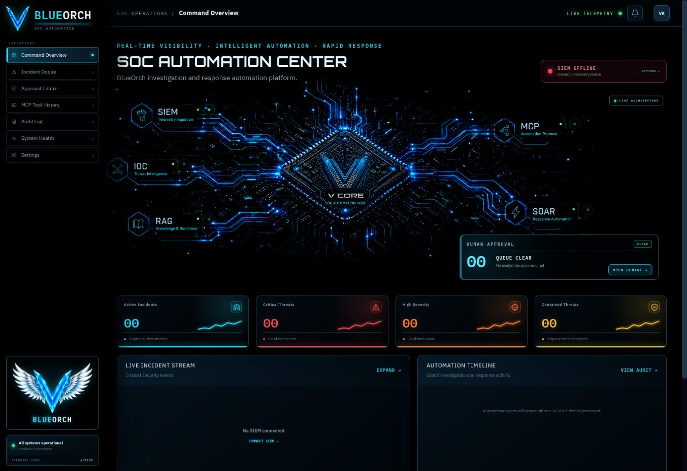
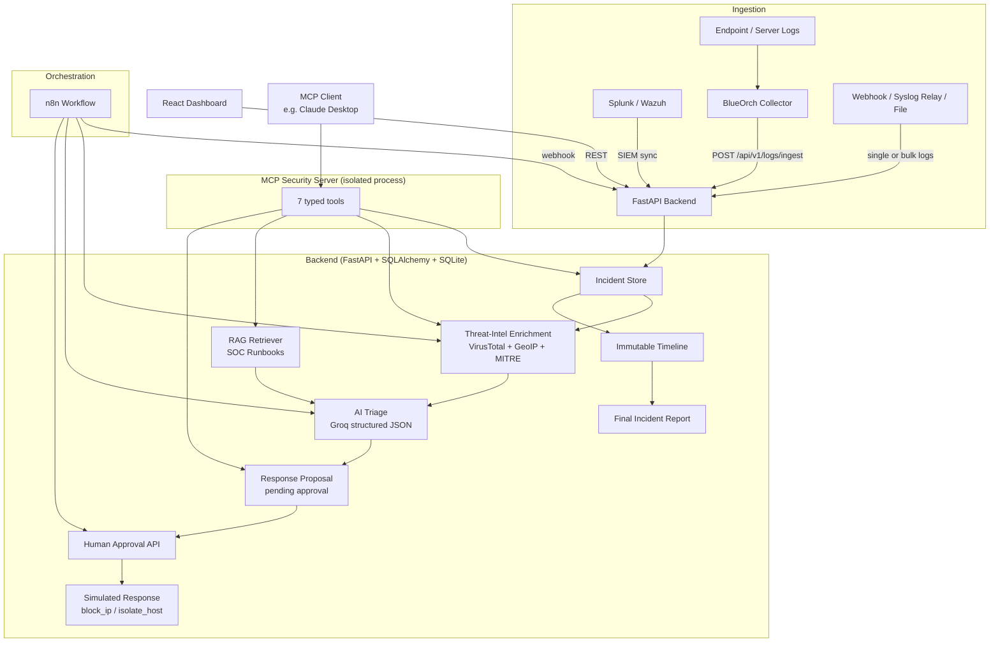
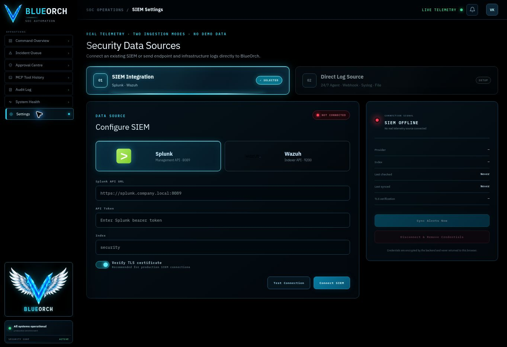
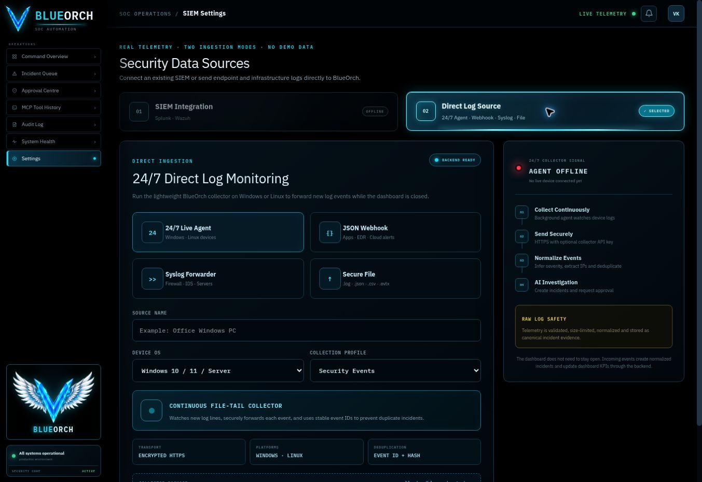

# BlueOrch — SOC Investigation & Response Automation Platform

[](https://aegisflow-soc-automation.vercel.app/)
[](frontend/)
[](backend/)
[](#testing)

### [Launch the live SOC dashboard →](https://aegisflow-soc-automation.vercel.app/)



BlueOrch is a working, end-to-end SOC (Security Operations Center) automation platform. It ingests
alerts from Splunk/Wazuh or receives endpoint logs directly through an agent, webhook, syslog relay, or
file pipeline. It normalizes events, enriches indicators of compromise, runs structured LLM-based triage, retrieves relevant
SOC runbooks with RAG, exposes its security tools through MCP, orchestrates the investigation with n8n,
requires human approval before any response action executes, and produces an evidence-linked final report.

**This is a real system, not a demo with static values.** Every screen in the dashboard is backed by a
live API call. Where a paid provider (Groq, VirusTotal) isn't configured, the system falls back to
clearly-labeled demo/fallback behavior instead of pretending to have data it doesn't.

The desktop-first command center uses fixed navigation and response rails, a live processor topology,
animated circuit telemetry, health monitoring, incident investigation views, approval controls, and
evidence-linked SOC automation workflows.

## Project status

| Phase | Description | Status |
|---|---|---|
| 1 | Alert ingestion & storage | ✅ |
| 2 | Threat-intel enrichment (VirusTotal, GeoIP, MITRE) | ✅ |
| 3 | Structured AI triage (Groq) | ✅ |
| 4 | RAG-based SOC runbooks | ✅ |
| 5 | MCP security server (7 tools) | ✅ |
| 6 | n8n orchestration workflow | ✅ |
| 7 | Human approval & response | ✅ |
| 8 | React SOC dashboard | ✅ |
| 9 | Security tests | ✅ |
| 10 | AI evaluation | ✅ |
| 11 | Docker & CI | ✅ (Docker builds are syntax-validated, not build-tested — see [Limitations](#known-limitations--honest-notes)) |
| 12 | Splunk & Wazuh SIEM connectivity | ✅ |
| 13 | Direct log normalization, deduplication & bulk ingestion | ✅ |
| 14 | Windows/Linux 24×7 file-tail collector | ✅ |
| 15 | Final incident report API | ✅ |

**119 backend tests passing** in the verified combined FastAPI/MCP test suite.

## Architecture



## Repository structure

```text
BlueOrch-SOC-Automation/
├── backend/               FastAPI app, MCP server, tests
│   ├── app/
│   │   ├── api/            Route handlers
│   │   ├── core/            Config, logging, rate limiting
│   │   ├── database/        SQLAlchemy session/engine
│   │   ├── models/           ORM models (incidents, triage, proposals, timeline, mcp audit)
│   │   ├── schemas/          Pydantic request/response schemas
│   │   ├── services/          Business logic
│   │   ├── integrations/      External API clients (VirusTotal)
│   │   ├── ai/                 Groq client + triage orchestration
│   │   ├── rag/                 Chunking, embeddings, vector store, retriever
│   │   └── mcp_server/           MCP tools, schemas, audit, redaction
│   ├── tests/                    119 tests
│   ├── requirements.txt           Main backend deps
│   └── requirements-mcp.txt        Isolated MCP server deps (see below)
├── frontend/                React + TypeScript + Vite SOC dashboard
├── n8n/                      Importable workflow JSON + error handler
├── collector/                 Dependency-free Windows/Linux 24×7 file-tail agent
├── runbooks/                  6 SOC runbooks (Markdown, RAG-indexed)
├── evaluation/                  AI eval dataset + runner + report
├── sample-data/                   Safe fictional sample alerts
├── docs/                           Supplementary docs (MCP setup, n8n import)
├── docker-compose.yml
└── .github/workflows/ci.yml
```

## Quick start (local, no Docker)

### 1. Backend

```bash
cd backend
python3 -m venv .venv
# Linux/macOS:
source .venv/bin/activate
# Windows (PowerShell):
.venv\Scripts\Activate.ps1

pip install -r requirements.txt
cp ../.env.example .env   # demo mode works with zero keys

uvicorn app.main:app --reload --port 8000
```

Visit `http://localhost:8000/health` — you should see `{"status": "ok", ...}`.
Interactive API docs: `http://localhost:8000/docs`.

### 2. Frontend

```bash
cd frontend
npm install
npm run dev
```

Visit `http://localhost:5173`. The dev server proxies `/api/*` to the backend on port 8000.

### 3. MCP server (optional — needed only if an MCP client will connect)

The `mcp` SDK requires a newer `starlette` than FastAPI supports, so it lives in its own venv:

```bash
cd backend
python3 -m venv .venv-mcp
# activate as above, then:
pip install -r requirements-mcp.txt
python -m app.mcp_server.server
```

See [docs/MCP_SETUP.md](docs/MCP_SETUP.md) for connecting an MCP client.

### 4. n8n (optional — needed for the orchestration workflow)

```bash
docker run -it --rm -p 5678:5678 n8nio/n8n
```

Then import `n8n/blueorch-error-handler.json` first and `n8n/blueorch-workflow.json` second.
Set `BLUEORCH_API_BASE=http://host.docker.internal:8000` when n8n runs in Docker, or
`http://backend:8000` with Docker Compose. See [n8n/README.md](n8n/README.md).

### 5. Test direct-log ingestion

```bash
curl -X POST http://localhost:8000/api/v1/logs/ingest \
  -H "Content-Type: application/json" \
  -H "X-BlueOrch-Key: $DIRECT_LOG_API_KEY" \
  -d '{"message":"Failed login brute force from 203.0.113.10 to 10.0.0.5","source_type":"agent","source_name":"windows-lab","event_id":"test-001"}'
```

Run the included continuous collector against any text log:

```bash
python collector/blueorch_agent.py \
  --file /path/to/security.log \
  --api-url http://localhost:8000 \
  --api-key "$DIRECT_LOG_API_KEY" \
  --source-name lab-device
```

Use `--from-start` to send existing lines or omit it to follow only new events.

## Environment variables

See [.env.example](.env.example) for the full reference. Everything defaults to safe demo values —
**zero API keys are required to run the system.**

| Variable | Purpose | Required? |
|---|---|---|
| `GROQ_API_KEY` | Live AI triage | No — falls back to rule-based triage |
| `VIRUSTOTAL_API_KEY` | Live IOC reputation | No — falls back to demo enrichment |
| `ENABLE_REAL_RESPONSE_ADAPTER` | Enable real (non-simulated) response actions | No — **must stay `false` unless you've implemented and reviewed a real adapter** |
| `DATABASE_URL` | SQLite by default, Postgres-compatible | No |
| `DIRECT_LOG_API_KEY` | Protects agent/webhook/bulk log-ingestion endpoints | Recommended for remote collectors |
| `BLUEORCH_API_BASE` | Backend base URL used by imported n8n workflows | Required in n8n |
| `SIEM_ENCRYPTION_KEY` | Encrypts stored Splunk/Wazuh credentials | Required when connecting SIEM |

## Testing

```bash
cd backend
python -m pytest -q   # 119 tests
```

Frontend:

```bash
cd frontend
npx tsc --noEmit    # type check
npm run build        # production build
```

AI evaluation:

```bash
cd backend
python ../evaluation/run_eval.py
```

See [evaluation/eval_report.md](evaluation/eval_report.md) for the latest run.

## Threat model (summary)

**In scope / mitigated:**
- SQL injection — parameterized queries via SQLAlchemy ORM throughout; tested in `test_security.py`.
- Prompt injection — the LLM's raw text output is never trusted; every triage response is validated
  against a strict Pydantic schema, and injected instructions in alert fields can at most influence the
  *content* of a still-schema-valid response, never bypass approval requirements (tested explicitly).
- Secret leakage — MCP audit logs and error messages are redacted (`app/mcp_server/redaction.py`);
  tested that API keys never appear in health checks or validation error bodies.
- Unauthorized/duplicate response actions — every response proposal requires human approval; approved
  proposals cannot be re-approved; rejected/expired proposals cannot execute.
- Oversized payloads / malformed JSON — request size limits and structured 422/413 handling.
- Rate limiting — per-IP sliding window middleware (configurable, default 120 req/min).
- Remote direct-log collection — optional `X-BlueOrch-Key` verification, payload limits,
  normalization, and event-id/fingerprint deduplication.

**Explicitly out of scope for this portfolio build:**
- User authentication/authorization and RBAC are not implemented. Direct-log collectors can use an API
  key, but a production deployment still needs an identity-aware gateway in front of analyst APIs.
- Multi-tenant isolation.
- Encryption at rest for the SQLite database.
- The `ENABLE_REAL_RESPONSE_ADAPTER` flag exists but no real adapter is implemented — response actions
  are always simulated in this repository, by design.

## Known limitations & honest notes

- **No live Groq/VirusTotal keys were used during development in this sandboxed environment** — those
  provider domains aren't reachable from the build environment's network policy. The live-API code paths
  are fully implemented and unit-tested with mocked HTTP responses, but have not been exercised against
  the real Groq/VirusTotal APIs. Bring your own keys locally to use them.
- **Docker images are syntax-validated, not build-tested** — Docker itself isn't available in the sandbox
  this was built in. The Dockerfiles and `docker-compose.yml` follow standard, well-tested patterns, but
  run `docker compose up --build` locally before relying on them in production.
- **RAG embeddings**: the primary path is `sentence-transformers` (downloads model weights from Hugging
  Face on first use). If that's unavailable, the system automatically falls back to a deterministic
  offline hashing-based vectorizer — lower semantic quality, but keeps RAG functional with zero external
  dependencies. Both paths are tested; `evaluation/eval_report.md` reports which one ran.
- **AI evaluation numbers reflect the rule-based fallback path** in this repository's committed report,
  since no Groq key was available at build time. Re-run `evaluation/run_eval.py` with `GROQ_API_KEY` set
  to get live-LLM metrics — see the report's own disclaimer for details.

## Troubleshooting

| Symptom | Likely cause / fix |
|---|---|
| `ModuleNotFoundError: mcp.server.fastmcp` | You're using the main `.venv`, not `.venv-mcp`. The MCP server needs its own environment — see [docs/MCP_SETUP.md](docs/MCP_SETUP.md). |
| Frontend shows "Backend unreachable" | Backend isn't running on port 8000, or `vite.config.ts`'s proxy target doesn't match. Confirm `curl http://localhost:8000/health` works first. |
| `sentence-transformers unavailable ... using offline hashing embedding fallback` in logs | Expected if the Hugging Face model hasn't been downloaded yet (needs network) or the package isn't installed. RAG still works via the fallback — see [Known Limitations](#known-limitations--honest-notes). |
| `pip-audit` / `npm audit` failing CI | These run with `|| true` in CI so they report but don't block merges by default — tighten this once you've triaged existing findings. |
| n8n workflow can't reach the backend | If running n8n via Docker Compose, use `http://backend:8000` (the service name), not `localhost`, as `BLUEORCH_API_BASE`. |
| `409 Conflict` on alert ingestion | Expected — this is the dedup/idempotency protection working. Check the `X-Existing-Incident-Id` response header for the existing incident. |
| `401 Invalid collector API key` | Send the same value configured as `DIRECT_LOG_API_KEY` in the `X-BlueOrch-Key` header. |

## End-to-end automation flow

```text
SIEM or Direct Log → Normalize & Deduplicate → Incident → IOC Enrichment → AI Triage
→ Human Approval → Simulated Response → Contained → Final Report
```

The n8n production webhook is `POST /webhook/blueorch-alert`. High/critical recommendations
create a pending response proposal; only BlueOrch's approval service can execute it. The final
report is available from `GET /api/v1/incidents/{incident_id}/report`.

## Screenshots

### SOC Command Center


The live overview presents the SIEM → enrichment → AI triage → investigation → approval → response
pipeline alongside system readiness, incident telemetry, MCP/RAG integrations, and fixed SOC rails.

### Security data sources — Splunk and Wazuh



The Settings workspace supports encrypted Splunk Management API and Wazuh Indexer connections,
connection testing, TLS verification, index selection, manual synchronization, and a live SIEM signal.

### Direct logs — Windows/Linux collector



The second ingestion mode documents the dependency-free `collector/blueorch_agent.py`, secured HTTPS
endpoint, source profile, Windows/Linux support, event fingerprinting, and continuous file-tail flow.

> The interface is optimized for desktop security operations. Live provider features depend on the
> environment variables documented above; response actions remain intentionally simulated.

## License

Released under the [MIT License](LICENSE). You may use, modify, and distribute
the project provided that the original copyright and license notice are retained.

Copyright © 2026 Vasanth Kumar.
