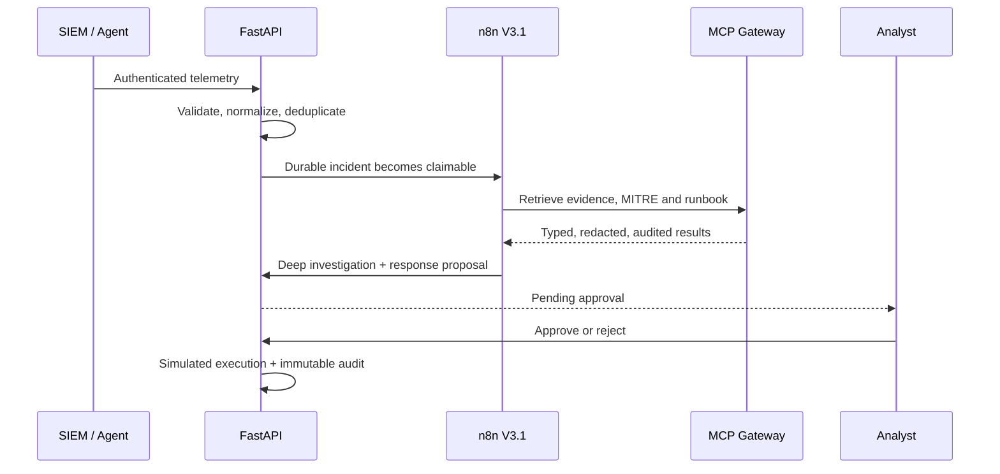
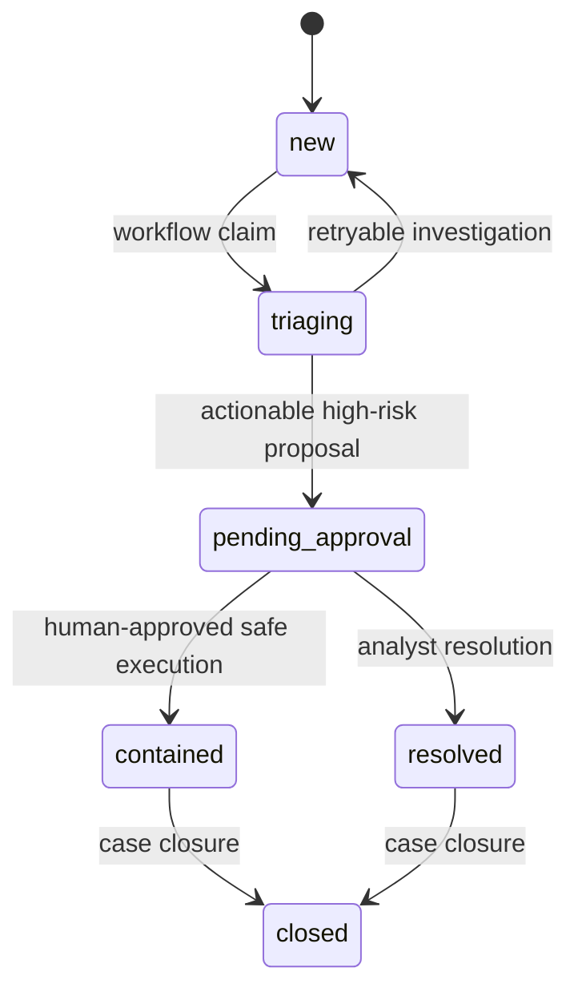

# BlueOrch Architecture

## System purpose

BlueOrch is a single-team SOC automation MVP that converts security telemetry into an evidence-grounded
investigation and a human-reviewed response proposal. It deliberately separates analysis from execution:
AI and MCP tools may investigate and recommend, but they cannot directly perform a destructive action.

## Component map

| Component | Responsibility | Trust boundary |
|---|---|---|
| React command centre | Live incidents, investigations, approvals, audit, MCP and health views | Authenticated operator session |
| FastAPI backend | Validation, authorization, business state, reports and APIs | Central policy enforcement point |
| PostgreSQL / SQLite | Incidents, identities, triage, proposals, timelines and audit records | Server-side database credentials |
| Windows collector | Reads new endpoint events, batches logs, heartbeats and disk retry | Per-device agent key |
| SIEM connectors | Pull alerts from Splunk or Wazuh | Encrypted connector credentials |
| n8n V3.1 | Claims durable incidents and coordinates the investigation | Scoped MCP service key |
| MCP gateway | Executes 7 allowlisted security tools with validation and audit | MCP API key + per-tool policy |
| Groq provider | Structured deep investigation when configured | Provider API key; output remains untrusted |
| VirusTotal | Live reputation when configured | Provider API key; failure states remain explicit |
| RAG runbooks | Retrieves local evidence-linked response guidance | Read-only curated Markdown corpus |

## Incident flow

## State model

## Security boundaries

- Operator routes use database-backed Admin, Analyst, and Viewer roles with signed httpOnly sessions.
- Collector registration and runtime ingestion use different credentials.
- n8n uses a scoped MCP key; it does not receive an operator password or browser session.
- Every MCP tool is typed, allowlisted, time-limited, redacted, and audited.
- LLM output is validated against structured schemas and cannot bypass the approval service.
- High-risk response remains human-gated. The current adapter records a simulation and does not claim
  contact with a real firewall, EDR, or IAM system.

## Deployment profiles

| Profile | Database | Providers | Intended use |
|---|---|---|---|
| Local zero-key | SQLite | Rule-based triage, offline RAG | Development and safe exploration |
| Connected lab | SQLite/PostgreSQL | Optional Groq, VirusTotal, SIEM, local n8n | End-to-end security lab |
| Deployed MVP | Persistent PostgreSQL | Groq, VirusTotal, remote MCP, n8n, collector | Portfolio and controlled single-team demo |
| Production pilot | PostgreSQL + backups | Adds Wazuh response and observability | Next phase; not current claim |

See [ROADMAP.md](ROADMAP.md) for phase exit criteria and the root
[README](../README.md#known-limitations--honest-notes) for current limitations.
